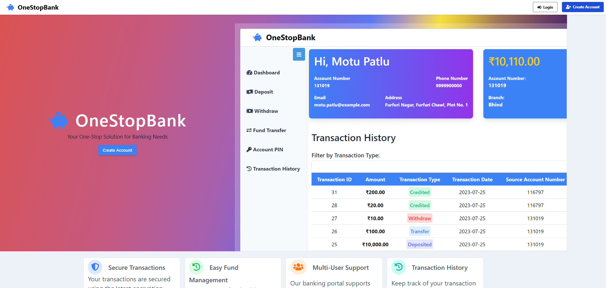
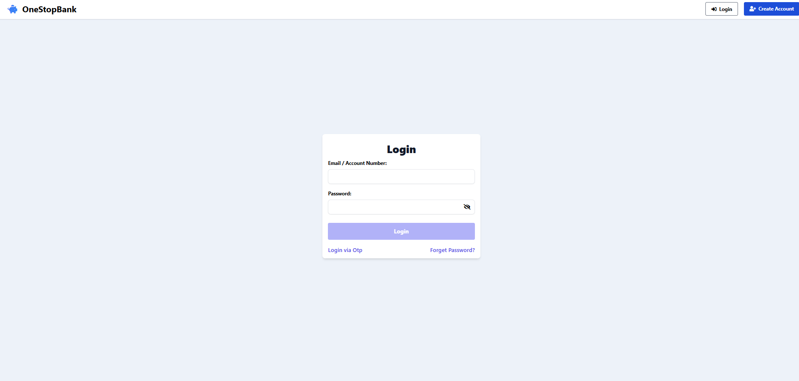
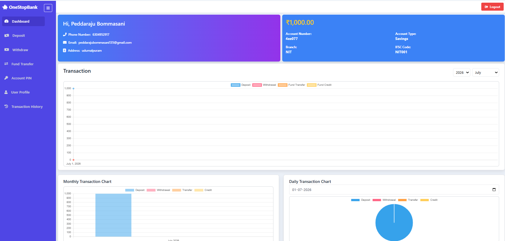
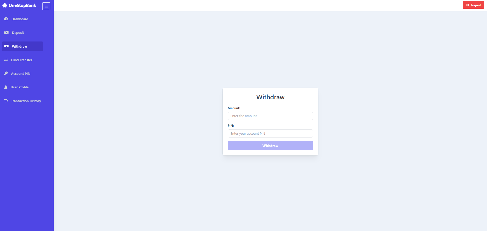
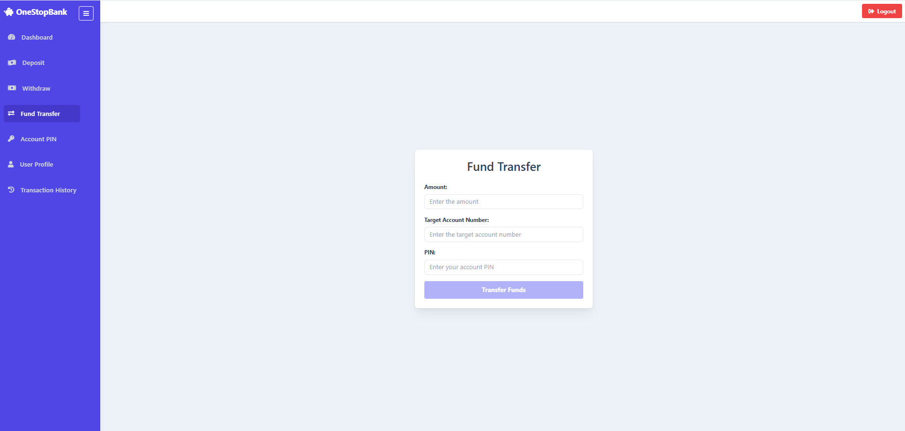
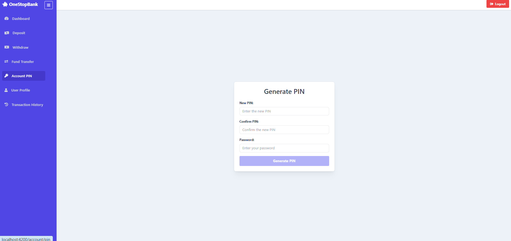

# Online Banking System using Spring Boot & Spring Security

A secure **Online Banking System** developed using **Java, Spring Boot, Spring Security, JWT, Hibernate, MySQL, and Angular**. This project demonstrates secure banking operations such as user authentication, account management, fund transfers, transaction history, OTP verification, and RESTful APIs.

---

## GitHub Repositories

### Backend Repository

🔗 https://github.com/peddarajubommasani13/Online-Banking-System

### Frontend Repository

🔗 https://github.com/peddarajubommasani13/Online-Banking-System-UI

---

## Banking Portal UI

The frontend is developed using **Angular** and communicates with the Spring Boot REST APIs.

---

# Project Overview

The Online Banking System provides secure banking services through REST APIs. It allows users to register, authenticate, manage accounts, perform transactions, and securely transfer funds.

---

## Features

- User Registration
- User Login using JWT Authentication
- Spring Security Authorization
- Account Creation
- PIN Management
- Cash Deposit
- Cash Withdrawal
- Fund Transfer
- Transaction History
- Password Reset using OTP
- Global Exception Handling
- RESTful APIs
- MySQL Database Integration
- Angular Frontend

---

## Technologies Used

### Backend

- Java 17
- Spring Boot
- Spring Security
- Spring Data JPA
- Hibernate
- JWT Authentication
- Maven

### Frontend

- Angular
- TypeScript
- HTML
- CSS

### Database

- MySQL

### Other Technologies

- Redis
- Caffeine Cache
- Git
- GitHub
- Postman

---

## Installation and Setup

### Clone Backend

```bash
git clone https://github.com/peddarajubommasani13/Online-Banking-System.git
```

### Clone Frontend

```bash
git clone https://github.com/peddarajubommasani13/Online-Banking-System-UI.git
```

---

## Backend Setup

Navigate to the backend project.

```bash
cd Online-Banking-System
```

Create a copy of

```
application.properties.sample
```

Rename it to

```
application.properties
```

Update the following properties:

- MySQL Username
- MySQL Password
- JWT Secret
- Mail Configuration
- Redis Configuration (Optional)

Run the backend:

```bash
./mvnw spring-boot:run
```

Backend URL

```
http://localhost:8180
```

---

## Frontend Setup

Navigate to the frontend project.

```bash
cd Online-Banking-System-UI
```

Install dependencies

```bash
npm install
```

Run Angular

```bash
npm start
```

Frontend URL

```
http://localhost:4200
```

---

## Database Setup

Create a MySQL database:

```sql
CREATE DATABASE bankingapp;
```

Hibernate will automatically generate all required tables during the first run.

---

## REST APIs

- User Registration
- User Login
- Generate OTP
- Verify OTP
- Reset Password
- Create Account
- Deposit Money
- Withdraw Money
- Fund Transfer
- Transaction History
- Dashboard APIs

---

## Screenshots

### Landing Page



---

### Login Page



---

### Dashboard



---

### Withdraw Money



---

### Fund Transfer



---

### Account PIN


## Future Enhancements

- Email Notifications
- PDF Bank Statements
- Dashboard Analytics
- Admin Panel
- Docker Deployment
- CI/CD Pipeline
- Kubernetes Deployment

---

## Error Handling

The application provides centralized exception handling for:

- Invalid Credentials
- Unauthorized Access
- Account Not Found
- Invalid OTP
- Insufficient Balance
- Validation Errors
- Token Expiration

---

## Author

**Peddaraju Bommasani**

GitHub

https://github.com/peddarajubommasani13

LinkedIn

https://www.linkedin.com/in/peddarajubommasani/

---

## License

This project is developed for educational, learning, and portfolio purposes.
